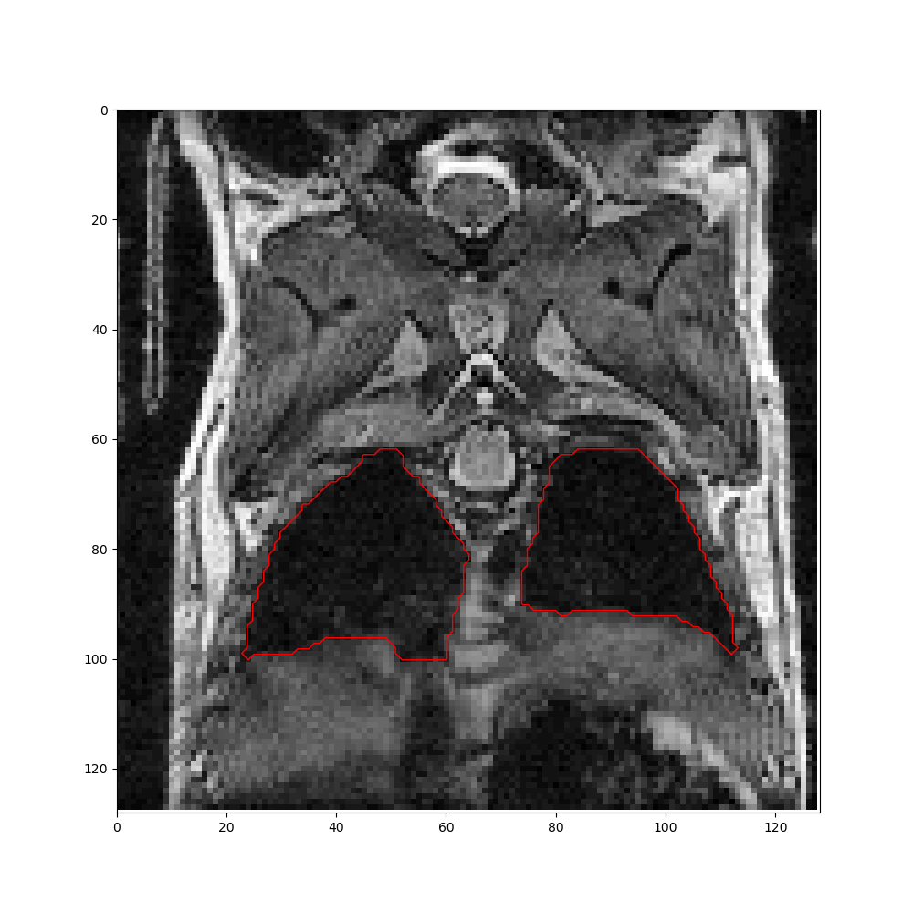
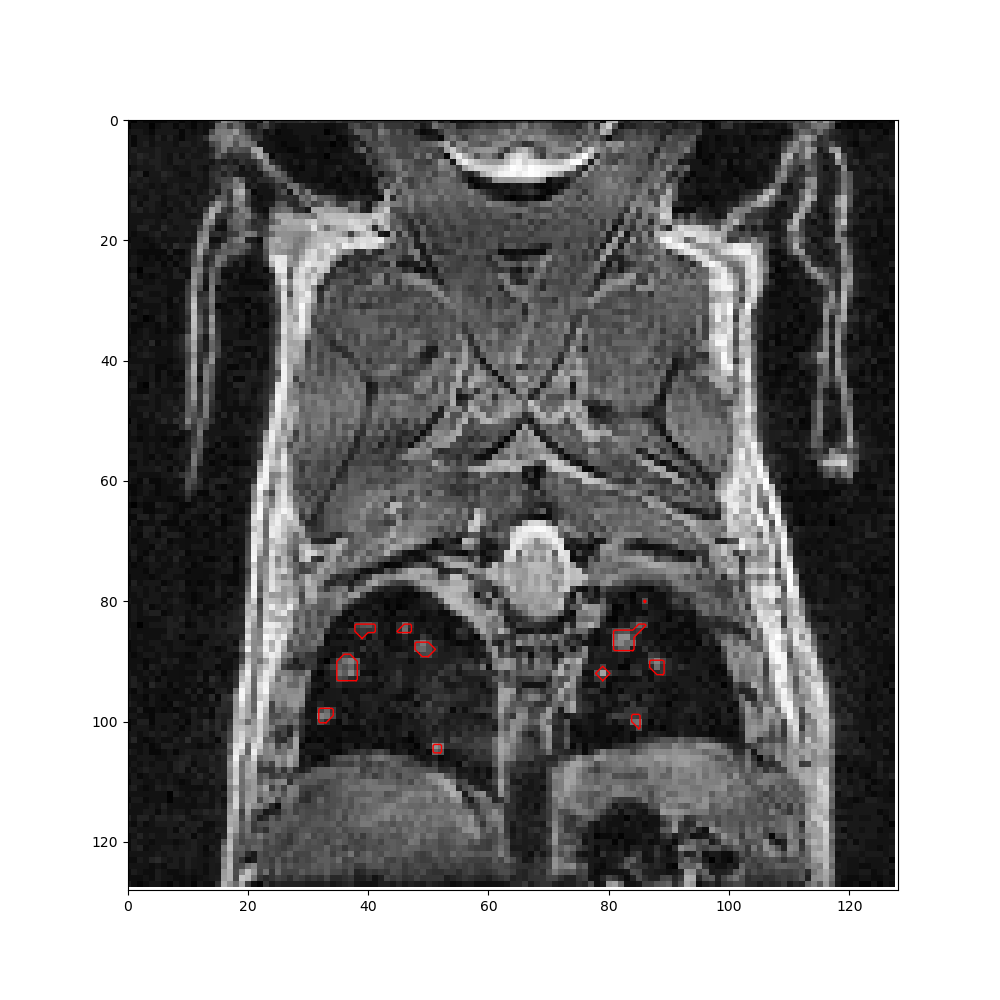
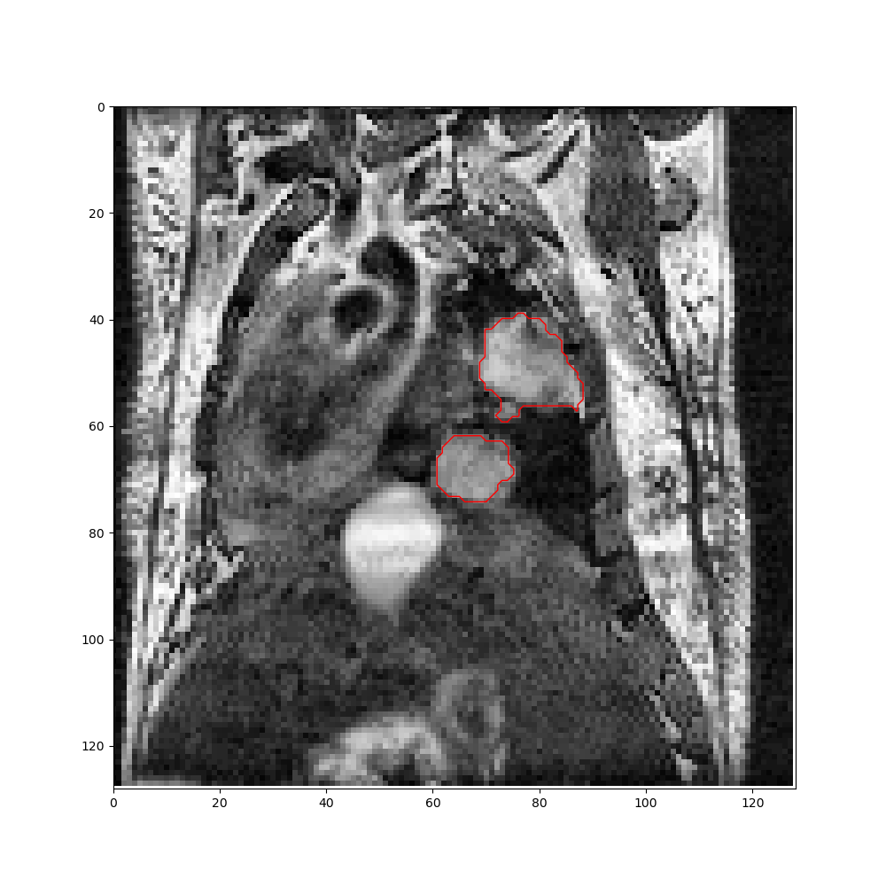

# DeepMeta

[](https://github.com/psf/black) [](https://github.com/pre-commit/pre-commit) [](https://github.com/EdgarLefevre/DeepMeta/blob/master/LICENSE)
<a href="https://gitmoji.dev">
  
</a>

Deep learning techniques used to segment lungs and metastasis on mice MRI images.


## Contents
- [Installation](#installation)
- [Performance](#performance)
- [Usage](#usage)
- [Documentation](#Documentation)
- [Demo](#Demo)


## Installation

We recommend you to use conda to create and manage dependencies.

To install required libraries:
```shell script
conda env create -f environment.yml
```

If you do not want to use conda, with python 3.6 and pip:
```shell script
pip install -f requirements.txt
```


> The environment files assume that you have at least one Nvidia Gpu installed on your computer.

## Performance
To measure the performance of each network, we rely on several metrics:
 - IoU (Jaccard index)
 - AUC (AUROC).
### Lungs


- Mean IoU on test data = 0.891
- Mean AUC on test data = 0.950

### Metastasis

<table>
  <tr>
    <td></td>
    <td align="right"></td>
  </tr>
<tr>
    <td align="center">Small metas</td>
    <td align="center">Big metas</td>
  </tr>
</table>

- Mean IoU on test data = 0.768
- Mean AUC on test data = 0.821

## Usage

You can find some example notebooks in `example` folder.
In these notebooks, we teach you how to train a model, run inference and generate graphs.

## Documentation

To generate documentation files and read them :

```shell
cd docs
make html
open _build/html/index.html
```

## Demo

To test our network rapidly on your images, we advise you to try our plugin for napari,
[napari-deepmeta](https://www.napari-hub.org/plugins/napari-deepmeta). This plugin allows you to try our 2 networks on your
images without writing any line of code.
