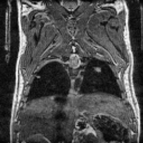
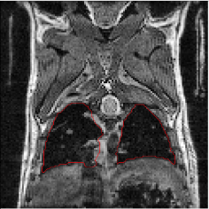
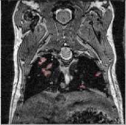

Welcome to DeepMeta's documentation!
====================================

DeepMeta is a solution for detecting lungs and metastasis on IRM images of mouses.

Quick Start
================

Installation
-------------

.. code-block:: bash

   git clone git@github.com:EdgarLefevre/DeepMetav4.git
   cd DeepMetav4
   conda env create -f environment.yml

Set up global vars
------------------

DeepMeta's code need some configuration before running.
Open the *utils/global_vars.py* file and then fill the **PATH_DATA** var.

Set up GPUS
------------
We have set a globar var *CUDA_VISIBLE_DEVICES* which aim is to select GPUS we want to work with.
If you want all available GPU(s) you can remove the declaration on top of the scripts.
Else, you need to assign ids of GPU(s) you want to use :

.. code-block:: python

   os.environ["CUDA_VISIBLE_DEVICES"] = "0,3,5"

Run training
------------

.. code-block:: bash

   python train.py

Availiable flags:

.. code-block:: text

   --n_epochs N_EPOCHS   number of epochs of training
   --batch_size BATCH_SIZE
                        size of the batches
   --lr LR               adam: learning rate
   --model_name MODEL_NAME
                        Name of the model you want to train (detection,
                        small++)
   --meta META           True if we want to segment metastasis
   --weighted WEIGHTED   Use weighted model (default False)
   --size SIZE           Size of the image, one number
   --w1 W1               weight inside
   --w2 W2               Weight border
   --patience PATIENCE   Set patience value for early stopper

Run inferecnce
--------------

.. code-block:: bash

   python predict.py

.. toctree::
   :maxdepth: 2
   :caption: Contents:

   train
   stats
   models

Indices and tables
==================

* :ref:`genindex`
* :ref:`modindex`
* :ref:`search`
