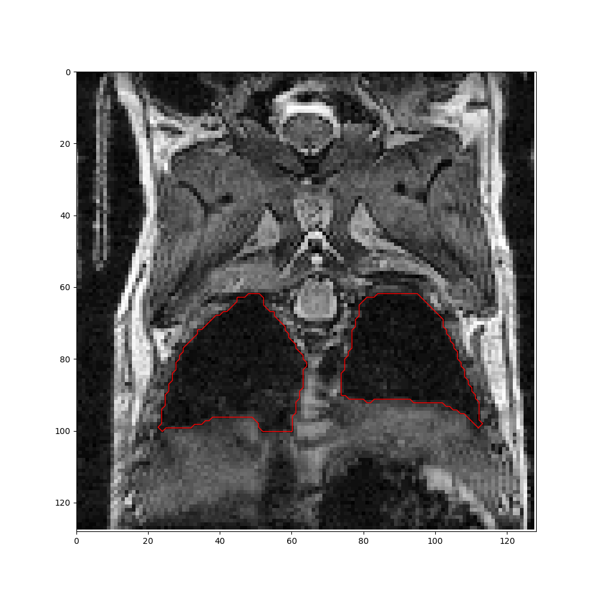

Welcome to DeepMeta's documentation!
====================================

Deep learning techniques used to segment lungs and metastasis on mice MRI images.

.. image:: _static/sm_metas_seg.png
   :width: 256

.. image:: _static/bg_meta_seg.png
   :width: 256

Performance
-------------

To measure the performance of each network, we rely on several metrics:
- IoU (Jaccard index)
- AUC (AUROC)

Lungs
    - Mean IoU on test data: 0.891
    - Mean AUC on test data: 0.950

Metas
    - Mean IoU on test data: 0.768
    - Mean AUC on test data: 0.820

.. toctree::
   :maxdepth: 2
   :caption: Contents:

   quick-start
   train
   pipeline
   models
   utils

Indices and tables
==================

* :ref:`genindex`
* :ref:`modindex`
* :ref:`search`
